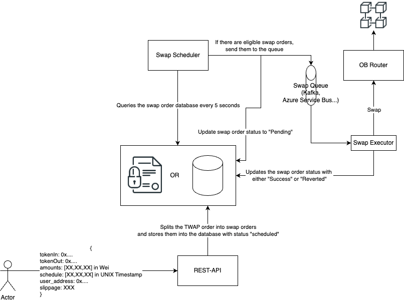

# OogaBooga Technical Test - Javier Sanz Sáez
---

## TL;DR: How to test the solution
1. Clone the repository
2. Create the .env files with the format of the corresponding .env.example
3. Deploy the Docker Compose project
4. Access the REST-API at localhost:3000/docs to read the Swagger docs

## Architecture
The full architecture of the solution can be seen in the following image.

### User Flow
1. User asks for a trade for X tokens in a Y time, specifying the intervals and the amounts to swap in each interval.
2. The backend checks if the splitting agent has enough allowance to commit the entire swap.
	1. If the agent does not have enough balance, the backend returns an error indicating the allowance granted to the router and the extra allowance needed for the swap to work.
	2. The user will have to interact with an open endpoint to generate the data of the transaction to sign.
3. The backend will then queue the split orders to the swap agent.
4. The user will be able to query to the backend the status of their swap orders

### Elements
The solution consists of:
- A REST-API application that serves as the receiving end for the user. In this component, the user can request the TWAP swap orders, as well as query their status.
	- If a user requests a TWAP swap order (providing an array of timestamps and amounts), the REST-API will create N swap orders in the Storage component.
- A Storage component that will store the swap orders.
- A Swap Scheduler. This component periodically queries the Storage component and processes those new orders that have been placed in the interval between queries.
- A Swap Queue. The Swap Orders will be queued by the Scheduler and consumed by the Swap Executors
- Swap Executor. This component will consume the swap orders from the queue and will create, sign and send the transactions into the blockchain. After sending them, the executor will wait for their completion or reversal and will update the Storage component pertinent entry with the status and other info.

The entire solution is encapsulated using Docker Compose, creating both volumes and networks to connect each component with each other.
### Assumptions
I have assumed the correct functioning of the OB API and OBRouter so that when the Swap Executors send the swap transactions to the blockchain, the user does receive the desired token output. If this is not the case, a possible improvement is to add code to the Swap Executors that validate that the swap quantities match those provided by the OBAPI and report them in the database if an inequality arises.

### Key Design decisions

#### Refresh Frequency and TWAP granularity

Since we have a component that is periodically querying the swap orders, a question arises: How frequent should the scheduler query the database to ensure a high throughput without overloading the system or overconsuming power?

A look at the current bibliography and state of the art renders the following table to identify the best way to tackle the issue.

| **Granularity**         | **Use Case**                                                           |
| ----------------------- | ---------------------------------------------------------------------- |
| **Every second**        | High-frequency trading (HFT) on highly liquid markets.                 |
| **Every 5-15 seconds**  | Large-cap assets with deep liquidity, minimizing order visibility.     |
| **Every 1-5 minutes**   | Mid-cap assets, balancing execution cost and market impact.            |
| **Every 15-30 minutes** | Low-liquidity markets, reducing the risk of moving the price too much. |

In our case, since all the swap orders are executed against a smart contract, we are limited by the blockchain itself. Despite the fact that Berachain uses Proof of Liquidity to increase the speed of transactions, it is a fact that it would take somewhere around 1 to 5 seconds for a transaction to be executed in a blockchain. 

Therefore, I have set a period of 5 seconds for the scheduler to query the database. I believe this allows the solution to swiftly process big batches of swap orders without consuming too many resources.

#### Storage
The storage of the Swap Orders can either be on-chain or off-chain. For simplicity, in this test I have opted for an off-chain MongoDb based storage solution, since it is the fastest way to set up a database and the Typescript library is quite intuitive. 

If we are focused on transparency, we could move all the swap order storage to an on-chain smart contract. This way, users could directly query the smart contract to check on the status of their swap orders.

#### Queuing swap orders
Since OogaBooga is an aggregator, there is a high chance that the TWAP endpoint may be flooded with requests, specially in times of higher-than-average volatility. This 

#### Limitless Allowance
Even though it does impact on the UX, I have decided NOT to grant unlimited allowance to the router for the TWAP swaps. This is basically a security preference, since there is always the risk of a zero-day vulnerability on the router contract that may cause fund drains. By ensuring that only the minimal allowance is granted, we mitigate the impact of this risk

#### User's involvement in the solution flow
From my experience in the Web3 space, it is vital that we keep the user interaction with the platform to the bare minimum. This is mainly to avoid two types of behaviour:
1. Malicious/Fraudulent meddling: If we delegate too many key actions to the user, we risk having some users intentionally altering the transactions or the parameters for their benefit. 
2. Negligent meddling: No matter how easy and simple you design an interface, there will always be a user that will use the endpoints wrong by sheer ignorance.

#### Queue technology
There are different solutions to this component and in my experience I have used both Kafka and Azure Service Bus Queues. For this solution I have opted for a Kafka implementation since it was the easiest to develop.

#### Visibility of components to the public
I have decided that only the REST-API component is the one that the user can interact with. This reduces the risks of vulnerabilities and exposures to key components, such as the Swap Queue.
## Possible Upgrades
1. No Front-End application has been created for this project, but the possibilites are endless with it. For instance, we can streamline the User Experience by providing an intuitive User Interface where the user can easily split the swap order into customizable intervals. This would also allow us to ensure that the format of the request sent to the Backend is guaranteed to be correct. Additionally, the Front-end could query the swap order status for the user and show them on screen, easily informing them about their orders.
2. Provide pre-made splitting options. For instance, we can offer the user the possibility to split the orders uniformly or based on Volume (Such as in the VWAP strategy). Additionally, we could also offer exponential splits, so that the largest part is immediately sent and the rest of the parts are diminishing in volume.
3. An endpoint to show exactly the TWAP achieved with the strategy. Since we already store the origin token amount and the destination token amount for all swap orders, we can simply add an identifier to the chain of swaps to keep track of all of them. Then, by simply calculating the TWAP formulae in the backend, we could provide an open endpoint that returns such value.